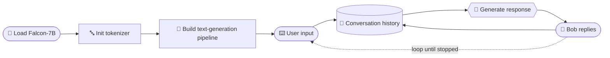

<div align="center">

<!-- 🦅 ───────────────────────────────────────────── 🦅 -->

# 🦅 Falcon-7B AI Chatbot

### *A conversational AI that remembers what you said.*

An interactive terminal chatbot powered by **Falcon-7B-Instruct**,
built with Hugging Face Transformers and PyTorch.

<br>


<br>

[**Features**](#-features) •
[**Quick start**](#-quick-start) •
[**Demo**](#-example-conversation) •
[**How it works**](#-how-it-works) •
[**Roadmap**](#-roadmap) •
[**Contributing**](#-contributing)

</div>

<br>

---

## 🚀 Overview

This project is an interactive AI chatbot built on the **Falcon-7B-Instruct**
large language model.

It keeps track of the conversation, generates **context-aware responses**, and
uses **GPU acceleration** for fast inference — a compact, readable example of
how to build a terminal-based conversational assistant with Hugging Face
Transformers.

---

## ✨ Features

<table>
  <tr>
    <td width="50%" valign="top">
      <h3>💬 Terminal Chat</h3>
      A simple, interactive chatbot that runs right in your terminal.
    </td>
    <td width="50%" valign="top">
      <h3>🧠 Falcon-7B-Instruct</h3>
      Powered by a capable open-source instruction-tuned LLM.
    </td>
  </tr>
  <tr>
    <td width="50%" valign="top">
      <h3>⚡ GPU Accelerated</h3>
      Fast inference with PyTorch and CUDA (optional).
    </td>
    <td width="50%" valign="top">
      <h3>🔥 Conversation Memory</h3>
      Context-aware replies that build on earlier messages.
    </td>
  </tr>
  <tr>
    <td width="50%" valign="top">
      <h3>🎯 Top-K Sampling</h3>
      Varied, natural-sounding text generation.
    </td>
    <td width="50%" valign="top">
      <h3>📝 Dynamic Prompts</h3>
      Prompts are built on the fly from the chat history.
    </td>
  </tr>
</table>

---

## 🛠️ Tech Stack

<div align="center">

| 🐍 Python | 🔥 PyTorch | 🤗 Transformers | 🦅 Falcon-7B-Instruct | 🟩 CUDA *(optional)* |
|:-:|:-:|:-:|:-:|:-:|

</div>

---

## 📂 Project Structure

```text
Falcon-Chatbot/
│
├── 🐍 chatbot.py          # Main chatbot script
├── 📋 requirements.txt    # Python dependencies
├── 📖 README.md           # You are here
└── 🖼️ assets/             # Images and media
```

---

## 🚀 Quick Start

### 1️⃣ Clone the repository

```bash
git clone https://github.com/yourusername/Falcon-Chatbot.git
cd Falcon-Chatbot
```

### 2️⃣ Install dependencies

```bash
pip install -r requirements.txt
```

<details>
<summary><b>📥 Required packages / manual install</b></summary>

<br>

```txt
torch
transformers
accelerate
sentencepiece
```

Or install them directly:

```bash
pip install torch transformers accelerate sentencepiece
```

</details>

> [!TIP]
> A 7B model in `bfloat16` needs roughly **14–16 GB of GPU memory**. A CUDA GPU
> is strongly recommended — running on CPU works but is much slower.

### 3️⃣ Run the chatbot

```bash
python chatbot.py
```

---

## 💻 Example Conversation

```text
> Hello

Bob:
Hello! How can I assist you today?

> Explain Artificial Intelligence.

Bob:
Artificial Intelligence (AI) is a field of computer science focused on creating
systems that can perform tasks requiring human intelligence, such as learning,
reasoning, and decision-making.

> Give me an example.

Bob:
A virtual assistant like ChatGPT or Siri is an example of AI that understands
natural language and responds to user queries.
```

---

## ⚙️ Model Configuration

```python
model = "tiiuae/falcon-7b-instruct"
```

| Component | Setting |
|---|---|
| 🦅 **Model** | Falcon-7B-Instruct |
| 🔤 **Tokenizer** | `AutoTokenizer` |
| 🔗 **Interface** | Hugging Face `pipeline` |
| 🎚️ **Precision** | `torch.bfloat16` |
| 🖥️ **Device** | `device_map="auto"` |

---

## 🧠 How It Works



1. **Load** the Falcon-7B model
2. **Initialize** the tokenizer
3. **Create** a text-generation pipeline
4. **Accept** user input
5. **Store** the conversation history
6. **Generate** the AI response
7. **Repeat** until the program is stopped

---

## 📈 Roadmap

- [ ] 🌐 Web interface (Streamlit)
- [ ] 🎙️ Voice assistant
- [ ] 📤 Chat history export
- [ ] 🔗 LangChain integration
- [ ] 📚 RAG (Retrieval-Augmented Generation)
- [ ] 📄 PDF question answering
- [ ] 🗄️ Memory database
- [ ] 🌍 Multi-language support

---

## 🎯 Learning Outcomes

This project is a hands-on introduction to:

| | |
|---|---|
| 🤖 **Large Language Models** | Working with an open-source LLM |
| ✍️ **Prompt Engineering** | Shaping prompts from conversation history |
| 📝 **Text Generation** | Sampling strategies such as Top-K |
| 🔗 **Hugging Face Pipelines** | The fastest way to run a model |
| 🧩 **Context Management** | Keeping chats coherent over many turns |
| ⚡ **GPU Inference** | Precision and device placement for speed |

---

## 🤝 Contributing

Contributions, suggestions, and improvements are welcome!

1. 🍴 **Fork** this repository
2. 🌿 Create a branch: `git checkout -b feature/your-feature-name`
3. 💾 Commit your changes: `git commit -m "Describe your change"`
4. 🚀 Push: `git push origin feature/your-feature-name`
5. 📬 Open a **pull request**

---

## 📜 License

Licensed under the **MIT License**.

---

<div align="center">

### ⭐ If you found this project helpful, give it a star!

<sub>Built with ☕ and curiosity 🧠</sub>

</div>
